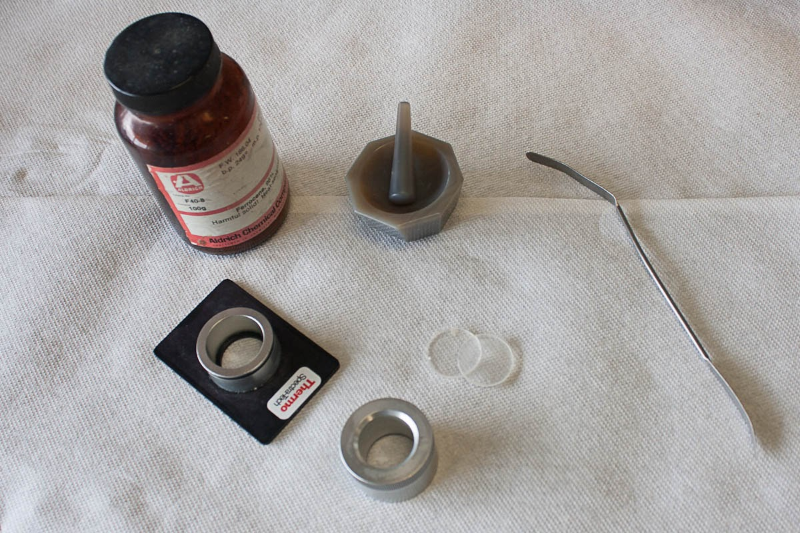

When two atoms combine to form a stable covalent molecular, there are two repulsion forces acting between the two heteroatoms. One between the positively charged nuclei of both the atoms and the other between the negative electron clouds. The other force is the attraction between the nucleus of one atom with the electrons of the other atom. Balancing the forces between them, the two atoms settle at a mean internuclear distance or the bond length where the total energy of the system is minimum. Any change like pulling the atoms away or squeezing them brings a change in the bond length which requires an input of energy.

A diatomic molecule with the above description is considered as two vibrating masses that are connected by a spring. The internuclear distance between the atoms at energy minimum is referred to as the equilibrium distance (re)Any change in this distance is given by Hooke' law as:

f = -k(r-re)

where f is the restoring force and r is the bond length. The energy associated considering the energy curve to be parabolic is given as :
E= 1/2k(r-re)2

For any harmonic oscillator, when the bond vibrates, its energy of vibration is changing continually and periodically from kinetic to potential energy and back again. The total energy is proportional to the frequency of vibration, and is given as:

Eosc = hνosc

The elastic nature of the bond has an intrinsic vibrational frequency which is determined by the force constant K of the spring or its stiffness, the masses of the bonded atoms.

where c is the speed of light, and μ is the reduced mass of the system which is given by:

μ = m1m2/m1 + m2

The value of the force constant varies from the bond to bond. K for a triple bond is three times those of a single bond and for a double bond, it is twice those of a single bond. There are two significant features that can be drawn:

1. Strong bonds have large force constants and vibrate at a higher frequency than weaker bonds.
2. Bonds between the heavy atoms (larger reduced mass) vibrate at a lower frequency than that of bonds between the lighter atoms.

The Infrared Spectrometer:
The infrared spectrometer or the spectrophotometer is the instrument that determines the IR absorption spectra of a compound. There are two types of spectrometers that are widely used in laboratories.
a. Dispersive infrared spectrometers
b. Fourier-Transform spectrometers

Figure 1: The main components of a Fourier transform infrared (FTIR) spectrophotometer.
Picture source: [Physical Methods in Chemistry and Nano Science](https://cnx.org/content/m34660/latest/?collection=col10699/latest)

FT-IR spectrometers are the modern spectrometers that provide the spectrum more rapidly than the dispersive ones. The optical pathway produces a pattern called the interferogram. This is a complex signal which is a plot of intensity versus time. For more practical purposes this time-domine spectrum is converted to a frequency-domain spectrum, that is intensity versus frequency. This conversion is done by a mathematical operation called a Fourier-Transform (FT). FT separates the individual frequencies from the interferogram producing a virtual spectrum identical to the one obtained from dispersive spectrometers. The biggest advantage of using FT-IR spectrometers is that it is possible to collect a number of interferograms of the same sample in less than a second. When a Fourier-Transform has performed a sum of all the interferograms gives a spectrum that has a better signal-to-noise ratio. Greater speed and greater sensitivity make FT-IR spectrometers preferred over dispersive spectrometers.

Figure 2: FT-IR spectrophotometers collect the interferograms of the sample and Fourier-transform them to an absorption spectrum.

Salt plates : While using solutions of samples is a common technique in IR spectroscopy, use of salt plated for the same is also a conventional use. The process of mulling is a common method of sample preparation for salt plates. The principle here is by grinding the particles to below the wavelength of incident radiation that will be passing through there should be limited scattering. To suspend those tiny particles, an oil is used. IR-transparent salt plates are used to hold the sample in front of the beam in order to acquire data. To prepare a sample for IR analysis using a salt plate, first decide what segment of the frequency band should be studied for the materials best suited for the sample. Figure shows the materials needed for preparing a mull.

Preparing the mull is performed by taking a small portion of the sample and adding approximately 10% of the sample volume worth of the oil and grinding this in an agate mortar and pestle. The resulting mull should be transparent with no visible particles. Another method involves dissolving the solid in a solvent and allowing it to dry in the agate pestle. If using this method, ensure that all of the solvent has evaporated since the solvent bands will appear in the spectrum. Some gentle heating may assist this process. This method creates very fine particles that are of a relatively consistent size. After addition of the oil further mixing (or grinding) may be necessary.

Plates should be stored in a desiccator to prevent erosion by atmospheric moisture and should appear roughly transparent. Some materials such as silicon will not, however. Gently rinse the plates with hexanes to wash any residual material off of the plates. Removing the plates from the desiccator and cleaning them should follow the preparation of the mull in order to maintain the integrity of the salt plates. Of course, if the plate is not soluble in water then it is still a good idea just to prevent the threat of mechanical trauma or a stray jet of acetone from a wash bottle.

Once the mull has been prepared, add a drop to one IR plate, place the second plate on top of the drop and give it a quarter turn in order to evenly coat the plate surface. Place it into the spectrometer and acquire the desired data. Always handle with gloves and preferably away from any sinks, faucets, or other sources of running or spraying water. Spectra acquired by this method will have strong C-H absorption bands throughout several ranges 3,000 – 2,800 cm-1 and 1,500 – 1,300 cm-1 and may obscure the signal.

Cleaning the plate as previously mentioned with hexanes or chloroform can easily be performed by rinsing and leaving them to dry in the hood. Place the salt plates back into the desiccator as soon as reasonably possible to prevent damage. It is highly advisable to polish the plates after use, no scratches, fogging, or pits should be visible on the face of the plate. Chips, so long as they don’t cross the center of the plate, are survivable but not desired. The damaged salt plates show common problems associated with use or potentially mishandling. Clouding, and to an extent, scratches can be polished out with an iron rouge. Areas where the crystal lattice is disturbed below the surface are impossible to fix and chips cannot be reattached.
